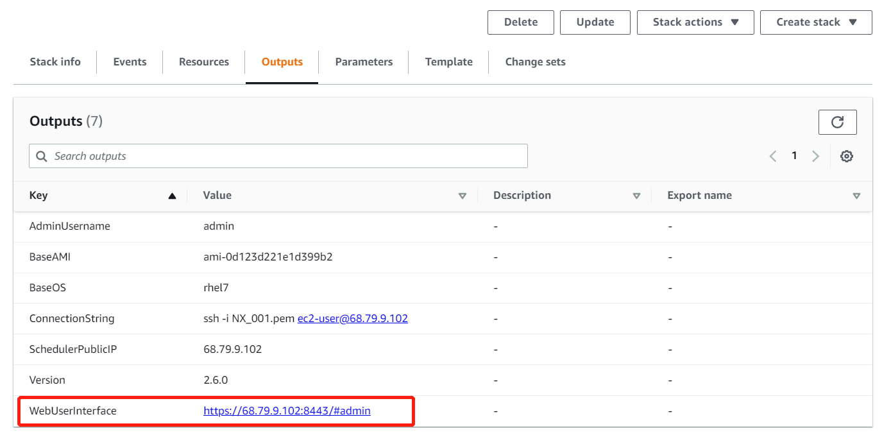

## 快速部署指南
您可以使用默认配置通过 CloudFormation 将此解决方案快速部署到中国宁夏区域（由西云数据运营）.
Region name | Region code | Launch
--- | --- | ---
AWS China(Ningxia) Region | cn-northwest-1 | [](https://console.amazonaws.cn/cloudformation/home?region=cn-northwest-1#/stacks/new?templateURL=https://nwcd-solutions.s3.cn-northwest-1.amazonaws.com.cn/scale-out-computing-on-aws/Seismic/scale-out-computing-on-aws-without-es.template)
## 使用指南
部署成功后，可以在CloudFormation服务中，在已部署好的堆栈输出信息列表中查看主节点访问链接。

1.添加删除用户
切换至root权限
```
add_user param1 param2 param3
```
param1:用户名称
param2:Shell类型（默认为/bin/bash)  -可选
param3:用户密码  -可选
```
del_user 用户名
```
2.启动集群
切换至root权限
加载环境变量
```
source /etc/environment
```
运行命令
```
[root@ip-a-b-c-d ~]# /apps/soca/$SOCA_CONFIGURATION/python/latest/bin/python3 \
      /apps/soca/$SOCA_CONFIGURATION/cluster_manager/add_nodes.py -h
usage: add_nodes.py [-h] --desired_capacity [DESIRED_CAPACITY] --instance_type
                    [INSTANCE_TYPE] --job_name [JOB_NAME] --job_owner
                    [JOB_OWNER] --queue [QUEUE] [--efa_support EFA_SUPPORT]
                    [--ht_support HT_SUPPORT] [--keep_forever KEEP_FOREVER]
                    [--terminate_when_idle [TERMINATE_WHEN_IDLE]]
                    [--base_os BASE_OS] [--fsx_lustre FSX_LUSTRE]
                    [--fsx_lustre_size FSX_LUSTRE_SIZE]
                    [--fsx_lustre_per_unit_throughput
                    FSX_LUSTRE_PER_UNIT_THROUGHPUT]
                    [--fsx_lustre_deployment_type FSX_LUSTRE_DEPLOYMENT_TYPE]
                    --instance_ami [INSTANCE_AMI] [--job_id [JOB_ID]]
                    [--job_project [JOB_PROJECT]]
                    [--placement_group PLACEMENT_GROUP]
                    [--root_size [ROOT_SIZE]] [--scratch_iops [SCRATCH_IOPS]]
                    [--scratch_size [SCRATCH_SIZE]]
                    [--spot_allocation_count [SPOT_ALLOCATION_COUNT]]
                    [--spot_allocation_strategy [SPOT_ALLOCATION_STRATEGY]]
                    [--spot_price [SPOT_PRICE]] [--keep_ebs]
                    [--subnet_id SUBNET_ID] [--tags [TAGS]]
                    [--weighted_capacity [WEIGHTED_CAPACITY]]

optional arguments:
  -h, --help            show this help message and exit
  --desired_capacity [DESIRED_CAPACITY]
                        Number of EC2 instances to deploy
  --instance_type [INSTANCE_TYPE]
                        Instance type you want to deploy
  --job_name [JOB_NAME]
                        Job Name for which the capacity is being provisioned
  --job_owner [JOB_OWNER]
                        Job Owner for which the capacity is being provisioned
  --queue [QUEUE]       Queue to map the capacity
  --efa_support EFA_SUPPORT
                        Support for EFA
  --ht_support HT_SUPPORT
                        Enable Hyper Threading
  --keep_forever KEEP_FOREVER
                        Whether or not capacity will stay forever
  --terminate_when_idle [TERMINATE_WHEN_IDLE]
                        If instances will be terminated when idle for N
                        minutes
  --base_os BASE_OS     Specify custom Base OK
  --fsx_lustre FSX_LUSTRE
                        Mount existing FSx by providing the DNS
  --fsx_lustre_size FSX_LUSTRE_SIZE
                        Specify size of your FSx
  --fsx_lustre_per_unit_throughput FSX_LUSTRE_PER_UNIT_THROUGHPUT
                        Storage baseline if FSX type is Persistent
  --fsx_lustre_deployment_type FSX_LUSTRE_DEPLOYMENT_TYPE
                        Type of your FSx for Lustre
  --instance_ami [INSTANCE_AMI]
                        AMI to use
  --job_id [JOB_ID]     Job ID for which the capacity is being provisioned
  --job_project [JOB_PROJECT]
                        Job Owner for which the capacity is being provisioned
  --placement_group PLACEMENT_GROUP
                        Enable or disable placement group
  --root_size [ROOT_SIZE]
                        Size of Root partition in GB
  --scratch_iops [SCRATCH_IOPS]
                        Size of /scratch in GB
  --scratch_size [SCRATCH_SIZE]
                        Size of /scratch in GB
  --spot_allocation_count [SPOT_ALLOCATION_COUNT]
                        When using mixed OD and SPOT, choose % of SPOT
  --spot_allocation_strategy [SPOT_ALLOCATION_STRATEGY]
                        lowest-price or capacity-optimized or diversified
                        (supported only for SpotFleet)
  --spot_price [SPOT_PRICE]
                        Spot Price
  --keep_ebs            Do not delete EBS disk
  --subnet_id SUBNET_ID
                        Launch capacity in a special subnet
  --tags [TAGS]         Tags, format must be {'Key':'Value'}
  --weighted_capacity [WEIGHTED_CAPACITY]
                        Weighted capacity for EC2 instances
```